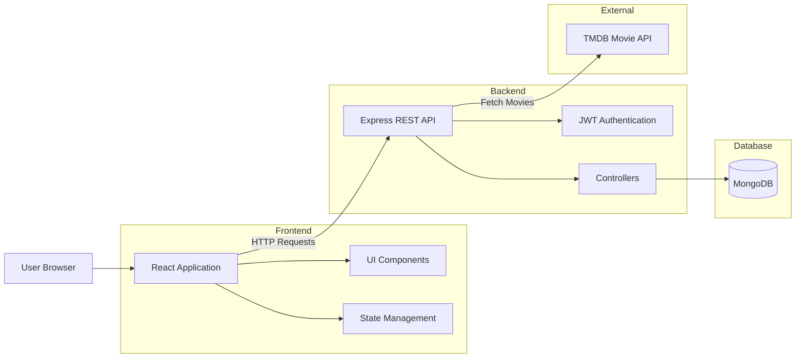

# 🎬 Netflix Clone (MERN)

A full-stack **Netflix-inspired streaming platform** built using the MERN stack.
The application replicates core Netflix functionality such as authentication, movie browsing, search, and trailer viewing while demonstrating full-stack architecture and API integration.

This project was developed to practice **scalable full-stack application development**, API integration, and modern UI design using React.

---

# 📖 Introduction

The **Netflix Clone MERN** project is a full-stack web application that simulates the user experience of a streaming platform. Users can authenticate, explore movies and TV shows, view trailers, and search content through a responsive interface.

The backend provides secure authentication and data handling, while the frontend delivers a dynamic and interactive UI similar to modern streaming services.

This project demonstrates practical implementation of:

* Full-stack MERN architecture
* REST API communication
* JWT authentication
* Third-party API integration (movie data)
* Responsive frontend design

---

# ✨ Features

* 🔐 **User Authentication** (JWT-based login/signup)
* 🎬 **Browse Movies & TV Shows**
* 🔎 **Search Movies, Actors, and Shows**
* 📺 **Watch Movie Trailers**
* ⭐ **Similar Movie Recommendations**
* 📜 **Search History Tracking**
* 📱 **Responsive Netflix-style UI**
* ⚡ **Dynamic Content Fetching from APIs**

---

# 🛠 Tech Stack

### Frontend

* React.js
* JavaScript (ES6+)
* Tailwind CSS / CSS
* Axios

### Backend

* Node.js
* Express.js
* JWT Authentication

### Database

* MongoDB
* Mongoose

### APIs & Tools

* Movie Database API (TMDB)
* Git & GitHub
* Node Package Manager (npm)

The MERN stack enables seamless full-stack development using JavaScript across both client and server layers. ([GitHub][1])

---

# 📦 Requirements

Make sure the following tools are installed before running the project:

* Node.js (v18 or higher recommended)
* npm or yarn
* MongoDB (local instance or MongoDB Atlas)
* Git
* TMDB API Key

---

# ⚙️ Installation

Clone the repository:

```bash
git clone https://github.com/pri-13/Netflix-Clone-MERN.git
cd Netflix-Clone-MERN
```

Install dependencies:

```bash
npm install
```

Install backend dependencies:

```bash
cd backend
npm install
```

Install frontend dependencies:

```bash
cd ../frontend
npm install
```

---

# 🔑 Environment Variables

Create a `.env` file in the root or backend directory:

```env
PORT=5000
MONGO_URI=your_mongodb_connection_string
JWT_SECRET=your_secret_key
TMDB_API_KEY=your_tmdb_api_key
NODE_ENV=development
```

---

# ▶️ Usage

Run the application locally.

### Development mode

```bash
npm run dev
```

### Production build

```bash
npm run build
npm run start
```

Open in browser:

```
http://localhost:5000
```

---

# 🏗 Architecture Review

Below is the high-level architecture of the application.



### Architecture Overview

**Frontend (React)**

* Handles UI rendering and user interactions
* Sends API requests to backend

**Backend (Node + Express)**

* Handles authentication
* Processes business logic
* Communicates with database

**Database (MongoDB)**

* Stores user data, search history, and preferences

**External API**

* Fetches movie metadata and trailers.

---

# 📸 Screenshots

Add screenshots of your application UI.

Example:

```
/screenshots
  home.png
  login.png
  movie-page.png
```

Example Markdown:

```markdown
## Home Page


## Login Page


## Movie Details

```

---

# 🚀 Future Improvements

* Watchlist / Favorites feature
* Video streaming integration
* Recommendation engine
* Role-based admin dashboard
* Deployment with Docker and CI/CD

---
