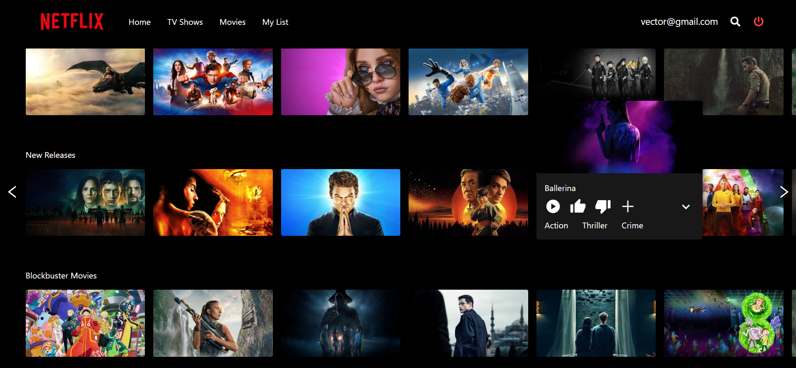
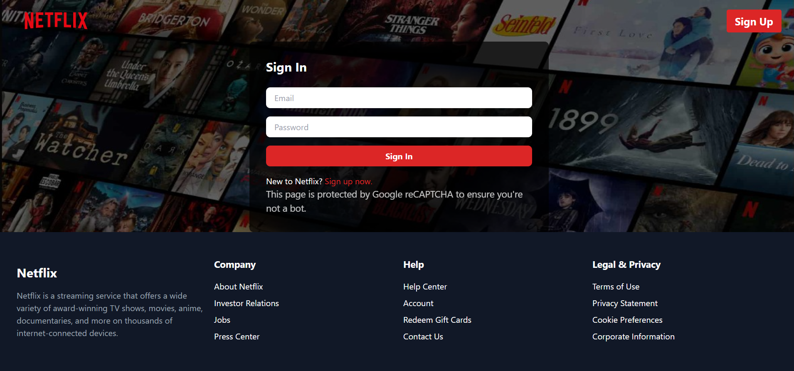
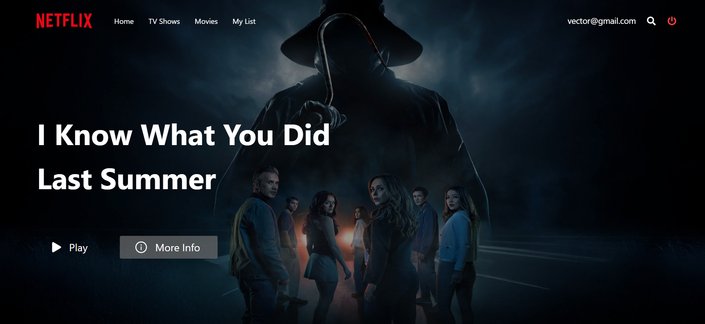

# 🎬 Netflix Clone (MERN Stack)


A **full-stack Netflix clone** built using the **MERN stack** that replicates core features of a modern streaming platform.
Users can browse movies, search content, watch trailers, and maintain their viewing/search history.

This project demonstrates how a scalable **full-stack JavaScript application** is structured using **React, Node.js, Express, and MongoDB**, while integrating a third-party movie database API.

---

# 📌 Introduction

The Netflix Clone is designed to simulate the experience of a streaming platform interface.
It focuses on building a **production-style architecture** that separates the frontend client and backend services.

The application integrates movie data from **TMDB (The Movie Database)** API and provides a modern responsive UI similar to Netflix.

This project is ideal for learning:

* Full-stack MERN development
* REST API integration
* Authentication with JWT
* Backend service design
* Frontend state management
* Real-world project architecture

---

# ✨ Features

### 🔐 Authentication

* User signup and login
* Secure authentication using **JWT**
* Protected routes

### 🎥 Content Browsing

* Browse trending movies
* Browse TV shows
* Fetch similar movies and recommendations

### 🔎 Search

* Search movies, TV shows, and actors
* Store user search history

### ▶️ Trailer Playback

* Watch movie trailers directly in the UI

### 📱 Responsive UI

* Netflix-inspired layout
* Mobile-friendly design

### 🌐 API Integration

* Real movie data fetched from **TMDB API**

---

# 🛠 Tech Stack

| Layer          | Technology     |
| -------------- | -------------- |
| Frontend       | React.js       |
| Backend        | Node.js        |
| Framework      | Express.js     |
| Database       | MongoDB        |
| Authentication | JWT            |
| API            | TMDB Movie API |

---

# 📂 Project Structure

```
Netflix-Clone-MERN
│
├── backend
│   ├── controllers
│   ├── routes
│   ├── models
│   ├── middleware
│   └── server.js
│
├── frontend
│   ├── src
│   │   ├── components
│   │   ├── pages
│   │   ├── hooks
│   │   └── utils
│
├── .env
├── package.json
└── README.md
```

---

# ⚙️ Requirements

Make sure the following are installed before running the project:

* **Node.js**
* **npm** or **yarn**
* **MongoDB** (Local or MongoDB Atlas)
* **TMDB API Key**

Create a `.env` file in the root directory:

```
PORT=5000
MONGO_URI=your_mongodb_connection_string
NODE_ENV=development
JWT_SECRET=your_jwt_secret
TMDB_API_KEY=your_tmdb_api_key
```

---

# 📦 Installation

Clone the repository

```
git clone https://github.com/pri-13/Netflix-Clone-MERN.git
```

Move into the project folder

```
cd Netflix-Clone-MERN
```

Install dependencies

```
npm install
```

---

# ▶️ Usage

Build the project

```
npm run build
```

Start the server

```
npm run start
```

Open the application in your browser

```
http://localhost:5000
```

---

# Architecture Review

**Frontend (React)**

* Handles UI rendering
* Sends API requests to backend
* Manages user state and routing

**Backend (Node + Express)**

* Provides REST API endpoints
* Handles authentication
* Communicates with TMDB API

**Database (MongoDB)**

* Stores users
* Stores search history
* Manages persistent data

**External API**

* TMDB API provides movie metadata, posters, and trailers

---

# 📸 Screenshots







You can then display them like this:

```

```

---

# 🚀 Future Improvements

* Watchlist feature
* User profiles
* Recommendation engine
* Video streaming integration
* Docker deployment
* CI/CD pipeline

---

# 📄 License

This project is created for **learning and portfolio purposes**.

---

# 👨‍💻 Author

**Priyanshu**

If you found this project useful, feel free to ⭐ the repository.


## How to Run

1. **Fork the Repository**
2. **Front-end Setup:**
   - Navigate to `netflix-ui` directory
   - Run `npm install` to install dependencies
   - Run `npm start` to launch the front-end

3. **Back-end Setup:**
   - Navigate to `backend` directory
   - Run `npm install` to install dependencies
   - Run `node index.js` to start the back-end server

## Contributors

Feel free to contribute to the project and make it even better!
